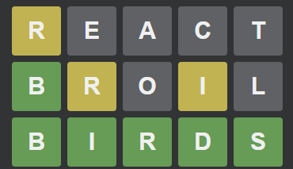

This project is a simple Wordle clone web I made to learn React



##### Run with Docker
```
cd worgle-react
docker build -t worgle-react-app .
docker run -p 3000:3000 worgle-react-app
```
##### Run with npm
```
cd worgle-react
npm install
npm start
```

### TO DO
- [ ] Reformat sizing to work on all device sizes/ratios
- [ ] Create fadeout for messages
- [ ] Add keydown event listener only on load
- [ ] Add definitions after game finishes
- [ ] Rework dictionary?
- [ ] Optimize Docker image
